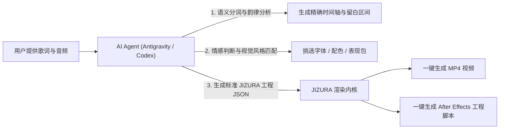

---

## 写在前面

是的 这个git甚至都是Gemini帮我put上来的/

这个项目这两天在国内的很多平台都有看见宣传，在中秋前看到852話发布这个工具之前 我就是一个对BGA/PV 感兴趣的学生。

这个分支说到底就三个事情：

1. **汉化**  
   我没做名词表 所以汉化的不是很到位 后续这些名词我的想法是可以和更多有实际项目经验的老师同步下，根据项目中AE特效插件名词组合去翻译（如果以后有新的内容 新的模板也是）尽可能的不要新造词组

2. **提供一个Agent 配合 歌曲BPM 节奏 鼓点 量产 特效文字的思路**  
   让文字预设能在大语言模型的理解下 变得更加实用，要是能让公共项目中的文字排版提升审美在商业上落地就更好了*

3. **作为我自己的分支开发路径**  
   2026年我的工作重心在视频生成与Agent 工具落地上，目前短剧业务在公司中跑的还算不错，但是未来我还是会很想通过生成式的内容在日本/亚洲市场能有更多的工作机会，希望我做的能帮到看到这段文字的你，也非常期待你能够帮助到我w


# JIZURA 字面 — 文字PV动力学引擎 (中日双语旗舰版 / Agent-Ready Fork)

<p align="center">
  
  
  
  
  
  
</p>

> 歌詞を入れると文字PV風動画を自動で組み立てるブラウザアプリ  
> **歌词动力学排版与文字PV自动生成工具 —— 让每一句歌词随节奏律动起舞。**

[**🇨🇳 简体中文 (当前默认)**](#-快速开始) | [**🇯🇵 日本語原版文档 (README_JA.md)**](./README_JA.md) | [**📦 绿色发行包下载 (Releases)**](https://github.com/yahnhaagendaz/JIZURA/releases) | [**🌐 在线免安装即用 (GitHub Pages)**](https://yahnhaagendaz.github.io/JIZURA/)

---

## 📢 开源致谢与版权声明 (Credits & Attribution)

> **特别致谢原作者**：  
> 本项目由 **yahnhaagendaz** 维护，深度基于日本开发者 **[852話 (@852wa)](https://github.com/852wa)** 创作的开源项目 **[852wa/JIZURA](https://github.com/852wa/JIZURA)** 进行重构与二次开发。
> 
> 感谢 **852話** 老师构筑了惊艳优雅的 350+ 文字PV动力学表现组件库与单文件 WebCodecs / AE 渲染架构！本项目在原版优秀能力的基础上持续演进，严格遵循 MIT 开源许可协议。
> - 原版仓库：https://github.com/852wa/JIZURA
> - 原版在线体验：https://852wa.github.io/JIZURA/
> - 版权归属：Copyright (c) 2026 hakoniwa (852wa) / Modified & Maintained by yahnhaagendaz

---

## 🧭 本分支的两大核心演进方向

本分支致力于将 JIZURA 从一个优秀的单机文字PV制作工具，演进为一个**兼具极致中文创作体验**与**原生拥抱 AI Agent 协同生态**的现代动力学引擎：

```
                    ┌───────────────────────────────────────────────┐
                    │      JIZURA v2.0+ (Agent-Ready Architecture)  │
                    └───────────────────────┬───────────────────────┘
                                            │
                ┌───────────────────────────┴───────────────────────────┐
                ▼                                                       ▼
  【方向一：深度汉化与创作者交互重塑】                     【方向二：AI Agent 协同与深度自定义开发】
  • 中日双语一键无缝热切换                                 • 工具侧加深自定义：解耦配置协议与组件扩展
  • 3-2-1 非侵入式节拍倒计时预备                           • 规范化 JSON 数据契约 (时间轴/排版/镜头/留白)
  • 0.5x / 0.75x 变速慢放打点 (快歌从容对点)               • 接入 Antigravity / Codex 等 Agent 驱动范式
  • ↶ 撤销重做 (智能回退音频 2.5s 随时纠错)               • 自动化工作流：Agent 歌词解析 ➔ 镜头编排 ➔ AE脚本导出
  • 独立视频轨时间轴与留白标定 (杜绝文字拉伸)               • 支持本地 HTTP / CLI 无头渲染自动化批处理
```

---

### 方向一：深度中文化与创作者交互重塑 (Localization & UX Overhaul)

针对中文音乐创作者与原版快歌对齐门槛高的痛点，进行了深度体验重构：

| 特性 | 功能说明与解决的痛点 |
|---|---|
| **🌐 中日双语无缝切换** | 顶部导航栏实时无缝切换「中文 / 日本語」，所有按钮、专业排版与 AE 动效术语完整本地化。 |
| **⏱️ 3-2-1 节拍倒计时预备** | 告别开局 `0.xx` 秒进唱措手不及！打点按键内部播放脉冲音画倒计时，**完全不遮挡**中央视频预览画面。 |
| **🐢 慢放变速打点 (0.5x / 0.75x)** | 极速快歌、密集说唱也能慢放从容对点；底层毫秒级采样自动无损换算映射至原曲绝对时间。 |
| **↶ 撤销上一句 (Backspace / Ctrl+Z)** | 点错拍子无需推倒重来！按 Backspace 键即刻撤销上一句打点，音乐智能倒退 2.5 秒无缝继续。 |
| **🎯 行号快速跳转与智能单框录入** | 点击歌词行号（如 `01`、`02`）直接预卷对齐；输入框直接支持时间点 `0.45` 或区间 `0-3`、`0.5-3.2`。 |
| **🎬 独立视频轨时间轴与留白标定** | 顶部开辟独立【歌词视频轨】，精准显示每句歌词的显示区间；静止间歇自动标出「留白 X.Xs」，**彻底杜绝文字僵硬拉伸**。 |
| **⌨️ 播放控制台快捷印章** | `S` 键直接将当前播放头打标为当前句起点，`E` 键打标为终点；`[` / `]` 键毫秒级前后微调。 |
| **🎨 100% 还原 Adobe AE 脚本** | `JIZURA_AE.jsx` 自动还原每段镜头的入点 (inPoint) 与出点 (outPoint)，留白期间图层自然隐藏。 |

---

### 方向二：AI Agent（如 Antigravity / Codex 等）协同调用与深度自定义结构

为了让大语言模型与自主代码代理（如 **Google Antigravity**、**OpenAI Codex**、**Claude Code** 等）能够无缝操控、扩展和批处理 JIZURA，本分支正在深化底层架构解耦：

#### 1. 工具侧加深自定义的开发结构 (Deeply Customizable Tooling)
- **数据契约标准化**：
  将歌词结构、时间区间（`startTime` ~ `endTime`）、动效组合（布局 Layout、运动 Motion、装饰 Decor、镜头 Camera、调色 Color）规范为纯净的 JSON 协议，不仅可在前端加载，更可由外部代码程序化生成。
- **表现包 (Expression Packs) 模块化机制**：
  将 350+ 个排版与动效片段解耦为规范化的函数库（`src/` 下），支持开发者与 Agent 自由编写自定义动效扩展，无需深入侵入核心渲染管线。
- **轻量本地服务与跨域调用支持**：
  提供内置的 `server.py` 与 `server.js`，预留了与外部自动化工具和浏览器扩展跨域通信的通道。

#### 2. Agent 工具协同调用范式 (Agent Invocation Paradigms)
在配合 **Antigravity / Codex** 等 AI Agent 时，Agent 可直接承担「自动化导演与编排师」的角色：



* **歌词韵律理解与时间轴生成**：  
  利用大模型的音频听打 (Whisper) 与韵律分析能力，Agent 可自动将歌词转换为带时间起止标签的格式：
  ```lrc
  [00:00.50-00:03.20] 这是第一句歌词（高能排版）
  [00:05.00-00:08.50] 这是第二句歌词（带 1.8s 纯净留白）
  ```
* **风格与分镜自适应推选**：  
  Agent 根据歌曲流派（古风、赛博朋克、摇滚、J-POP、抒情等），自动配置 Google Fonts 中文字体库、色环对比参数与故障强度。
* **工程脚本与批量产出**：  
  Agent 通过本地执行环境驱动 `build.py` / `build.js`，或直接生成用于 Adobe After Effects 渲染的 `_ae.json`，实现全自动无人值守批量制片。

---

## 🚀 快速开始

### 方式 1：绿色解压即用包（最简推荐）
1. 在 [Releases 发布页面](https://github.com/yahnhaagendaz/JIZURA/releases) 下载最新版 `JIZURA_v2.0.0_CN_Bilingual_Release.zip`。
2. 解压到任意文件夹。
3. **Windows 用户**：双击运行 `start.bat`，脚本将自动检测环境、启动加速服务并在浏览器中打开。
4. **离线免安装**：亦可直接双击解压出的 `index.html`，在任意现代浏览器（Chrome / Edge / Firefox）中离线使用。

### 方式 2：命令行服务启动
```bash
# 克隆仓库
git clone https://github.com/yahnhaagendaz/JIZURA.git
cd JIZURA

# 方式 A：使用 Python 启动本地服务（支持 WebCodecs 极速导出）
python server.py

# 方式 B：使用 Node.js 启动服务
node server.js
```
启动后访问：`http://localhost:8520/`。

### 方式 3：在线免安装体验
无需下载任何文件，直接在浏览器中打开：  
👉 **[https://yahnhaagendaz.github.io/JIZURA/](https://yahnhaagendaz.github.io/JIZURA/)**

---

## ⌨️ 常用快捷键一览

| 快捷键 | 所在模式 | 作用 |
|---|---|---|
| `Space` (空格) / `Enter` | 打点对齐模式 | 打点记录当前句起点，并自动跳至下一句 |
| `Backspace` / `Ctrl+Z` | 打点对齐模式 | **撤销上一句打点**，并自动倒带 2.5 秒以便重打 |
| `S` 键 | 预览与微调 | 将当前播放头直接打标为当前句**起点** |
| `E` 键 | 预览与微调 | 将当前播放头直接打标为当前句**终点** |
| `[` / `]` | 预览与微调 | 将当前句时间戳前后微调 ±0.05 秒 |
| `R` 键 | 主界面 | **一键换案（おまかせ）**，全量重构排版风格与镜头 |
| `Space` (空格) | 主界面 | 播放 / 暂停视频预览 |

---

## 🛠️ 开发者指南与构建说明

JIZURA 采用极为优雅的单文件分发架构。所有源码均位于 `src/` 与 `app/` 中：

```bash
# 使用 Node.js 打包构建 index.html
node build.js

# 或使用 Python 打包构建 index.html
python build.py

# 构建 After Effects 脚本 (ae/ -> JIZURA_AE.jsx)
python build_ae.py
```

---

## 🤝 参与贡献与致谢

- 再次致谢原作者 **[852話 (@852wa)](https://github.com/852wa/JIZURA)** 开创的优秀基石。
- 欢迎各位开发者、文字PV创作者与 AI Agent 探索者提交 Issue 与 Pull Request！
- 无论是新增汉字排版字体、扩展动效表现包，还是探索更多与 Agent（如 Antigravity / Codex）联动的自动化工作流，我们都非常期待与你一同探讨！

---

## 📄 开源许可证

本项目继承原作者项目的开源许可，采用 [MIT License](./LICENSE)。  
使用的第三方库（mp4-muxer 等）遵循各自开源协议，详见 [THIRD_PARTY_NOTICES.md](./THIRD_PARTY_NOTICES.md)。
